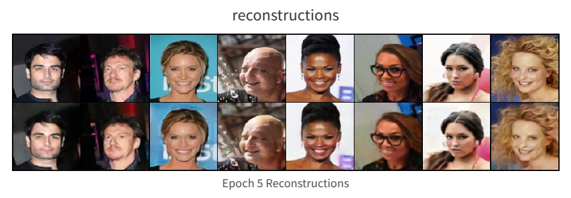

# Vector Quantized Variational AutoEncoder (VQ-VAE)

## Project Overview

This is a PyTorch implementation of VQ-VAE for image compression and reconstruction. VQ-VAE learns discrete latent representations through vector quantization, enabling efficient compression and reconstruction of image data.



## Model Architecture

The implementation consists of the following key components:

1. **Encoder**: 
   - Uses multiple residual blocks for feature extraction
   - Outputs tensor of shape (batch_size, embedding_dim, height, width)

2. **Vector Quantizer**:
   - Implements codebook and nearest neighbor search
   - Uses straight-through estimator for gradient propagation
   - Computes codebook and commitment losses

3. **Decoder**:
   - Mirror structure of the encoder
   - Reconstructs original image through transposed convolutions

## Implementation Details

### Key Improvements

1. **Enhanced Straight-through Estimator**:
   ```python
   # Store original quantized values for loss computation
   ori_quantized = quantized
   
   # Apply straight-through estimator
   quantized = x + (quantized - x).detach()
   ```
   This separation ensures:
   - Clean gradient flow through the encoder
   - Accurate loss computation using original quantized values
   - Better training stability

2. **Refined Loss Computation**:
   ```python
   # Using original quantized values for codebook updates
   quantized_loss = torch.mean((ori_quantized.detach() - encoder_output) ** 2)
   commitment_loss = torch.mean((encoder_output.detach() - ori_quantized) ** 2)
   loss = reconstruction_loss + quantized_loss + 0.25 * commitment_loss
   ```
   Benefits:
   - More precise codebook learning
   - Better balance between reconstruction and quantization

### Loss Function

The total loss consists of three components:
- **Reconstruction Loss**: MSE between reconstructed and original images
- **Quantization Loss**: MSE between encoder output and nearest codebook vectors
- **Commitment Loss**: Ensures encoder outputs stay close to codebook vectors

## Usage

1. Install Dependencies:
```bash
pip install torch torchvision wandb tqdm Pillow
```

2. Data Preparation:
   - Uses CelebA dataset by default
   - Images are resized to 128x128 and normalized

3. Training:
```bash
python trainer.py
```

4. Visualization:
   - Training progress tracked via wandb
   - Monitor reconstruction and quantization losses
   - Periodic saving of reconstruction samples

## Model Parameters

- input_dim: 3 (RGB images)
- hidden_dim: 256
- embedding_dim: 128
- num_resblocks: 4
- num_embeddings: 512 (codebook size)
- learning_rate: 2.25e-4

## Project Structure

- `VQ_VAE.py`: Core VQ-VAE model implementation
- `Encoder.py`: Encoder network
- `Decoder.py`: Decoder network
- `trainer.py`: Training loop and loss computation
- `Datasets.py`: Data loading and preprocessing

## References

- [VQ-VAE的简明介绍：量子化自编码器](https://spaces.ac.cn/archives/6760)
- [vq-vae-2-pytorch](https://github.com/rosinality/vq-vae-2-pytorch)

## Training Tips

1. Monitor the balance between reconstruction and quantization losses
2. Watch for codebook usage patterns through wandb visualizations
3. Adjust the commitment loss weight (0.25) if needed for stability